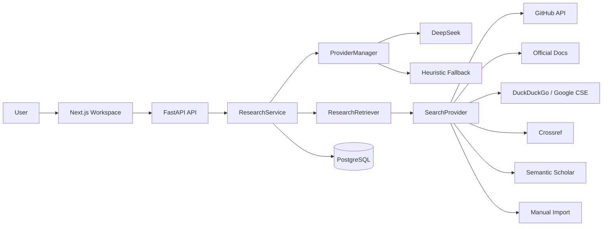
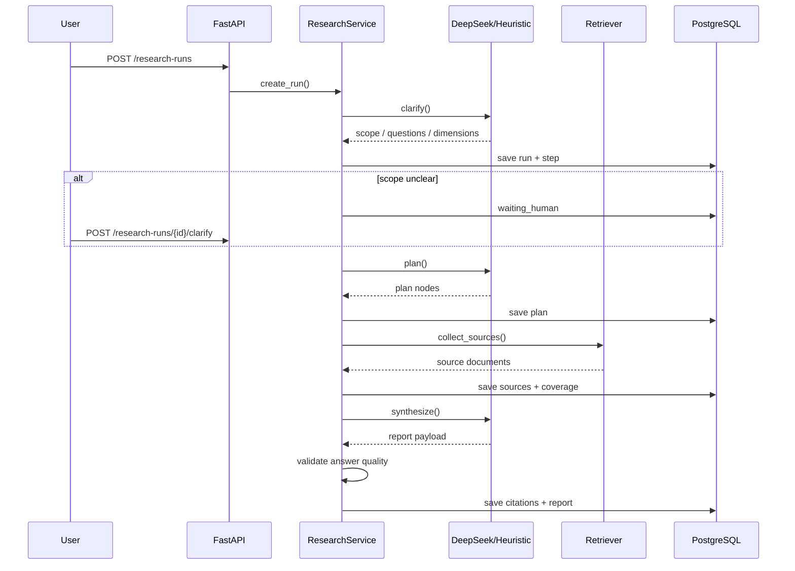

# SignalDesk / 研策台

`SignalDesk` is an `Agentic Deep Research System` for `AI / Agent` technology selection.

It is not a chat wrapper. A research task is decomposed into `clarify -> plan -> retrieve -> synthesize -> validate`, persisted end-to-end, and exported as a citation-backed report with explicit confidence and evidence coverage.

## What it does

- Starts from a single search box and turns a vague technical question into a structured research run
- Clarifies scope before retrieval when the question is too broad
- Aggregates evidence from `GitHub API`, official docs, web search, `Crossref`, and manual imports
- Persists runs, plan nodes, sources, steps, citations, and reports in `PostgreSQL`
- Generates structured Chinese reports with citation backlinks and `Markdown / PDF` export
- Applies `coverage / verdict / confidence` guardrails to avoid strong recommendations under weak evidence
- Supports human-in-the-loop interactions: clarify scope, exclude weak sources, manually import evidence, retry a stage

## Why this project matters

Most AI demos stop at “retrieve then answer”.  
SignalDesk models the full research workflow:

- scope definition
- planning
- multi-source evidence collection
- synthesis
- answer validation

That makes it much closer to a real `AI application / agent engineering` project than a generic chatbot or a thin RAG demo.

## Architecture



## Research loop



## Core capabilities

### 1. Agentic research workflow

- `Clarifier`
- `Planner`
- `Retriever`
- `Synthesizer`
- `Answer Validator`

### 2. Search provider abstraction

Current providers:

- `GitHub`
- `Official Docs`
- `DuckDuckGo`
- `Crossref`
- `Semantic Scholar` (optional)
- `Google Programmable Search` (optional)
- `Google Scholar Manual` (manual import only)
- `CNKI Manual` (manual import only)

### 3. Evidence modeling

Main persisted entities:

- `ResearchRun`
- `ResearchPlanNode`
- `SourceDocument`
- `RunStep`
- `Citation`
- `FinalReport`

### 4. Answer guardrails

The report is not allowed to blindly recommend under poor evidence.

SignalDesk computes:

- `coverage_summary`
- `verdict`
- `recommendation_confidence`
- `missing_evidence`
- `question_alignment_notes`

If a multi-candidate comparison is imbalanced, the output is downgraded to `insufficient_evidence`.

## Real run snapshots

These are real runs from the current local service, not fabricated benchmark numbers:

| Scenario | Run ID | Targets | Sources | Citations | Duration | Result |
| --- | --- | ---: | ---: | ---: | ---: | --- |
| Python agent foundation selection: LangGraph vs PydanticAI vs Mastra | `research_22f8fcc3c7` | 3 | 15 | 35 | 164.5s | `grounded / high` |
| Single-model evaluation: should DeepSeek be the default Chinese research backend? | `research_6ce72c568b` | 1 | 3 | 7 | 133.2s | `grounded / medium` |
| Regression case after excluding Mastra evidence | `research_0a1068cdbb` | 3 | 15 | 28 | verified | `insufficient_evidence / low` |

The third case is important: it demonstrates that the system downgrades conclusions when evidence becomes unbalanced.

## Tech stack

- Frontend: `Next.js`, `TypeScript`, `Tailwind CSS`
- Backend: `FastAPI`
- Database: `PostgreSQL`
- Model provider: `DeepSeek`
- Retrieval: `GitHub API`, official docs scraping, web search, `Crossref`, manual imports

## Key API routes

- `POST /research-runs`
- `GET /research-runs`
- `GET /research-runs/{id}`
- `GET /research-runs/{id}/steps`
- `GET /research-runs/{id}/sources`
- `POST /research-runs/{id}/sources/import`
- `POST /research-runs/{id}/sources/{source_id}`
- `GET /research-runs/{id}/report`
- `GET /research-runs/{id}/report/markdown`
- `GET /research-runs/{id}/report/pdf`
- `POST /research-runs/{id}/clarify`
- `POST /research-runs/{id}/retry-step`

## Local setup

### 1. Install backend dependencies

```powershell
pip install -r backend\requirements.txt
```

### 2. Install frontend dependencies

```powershell
cd frontend
npm install
cd ..
```

### 3. Start PostgreSQL

```powershell
docker compose -p deepresearch up -d postgres
```

### 4. Start backend

```powershell
python -m uvicorn backend.app.main:app --host 127.0.0.1 --port 8000
```

### 5. Start frontend

```powershell
cd frontend
npm run dev
```

## Local addresses

- Frontend: `http://127.0.0.1:3000`
- Backend: `http://127.0.0.1:8000`
- PostgreSQL: `127.0.0.1:15432`

## DeepSeek configuration

See [docs/PROVIDER_CONFIG.md](docs/PROVIDER_CONFIG.md) for full details.

```powershell
DEEP_RESEARCH_DEFAULT_PROVIDER=deepseek
DEEP_RESEARCH_DEEPSEEK_API_KEY=your_key
DEEP_RESEARCH_DEEPSEEK_BASE_URL=https://api.deepseek.com/v1
DEEP_RESEARCH_DEEPSEEK_MODEL=deepseek-chat
```

If no API key is configured, the system falls back to the heuristic provider so the workflow can still be demonstrated.

## Additional docs

- Architecture: [docs/ARCHITECTURE.md](docs/ARCHITECTURE.md)
- Demo script: [docs/DEMO_SCRIPT.md](docs/DEMO_SCRIPT.md)
- Interview pitch: [docs/INTERVIEW_PITCH.md](docs/INTERVIEW_PITCH.md)
- Case studies: [docs/CASE_STUDIES.md](docs/CASE_STUDIES.md)
- Resume notes: [docs/RESUME_NOTES.md](docs/RESUME_NOTES.md)
- Provider config: [docs/PROVIDER_CONFIG.md](docs/PROVIDER_CONFIG.md)
