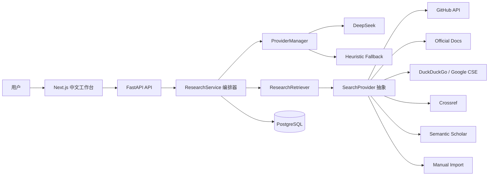
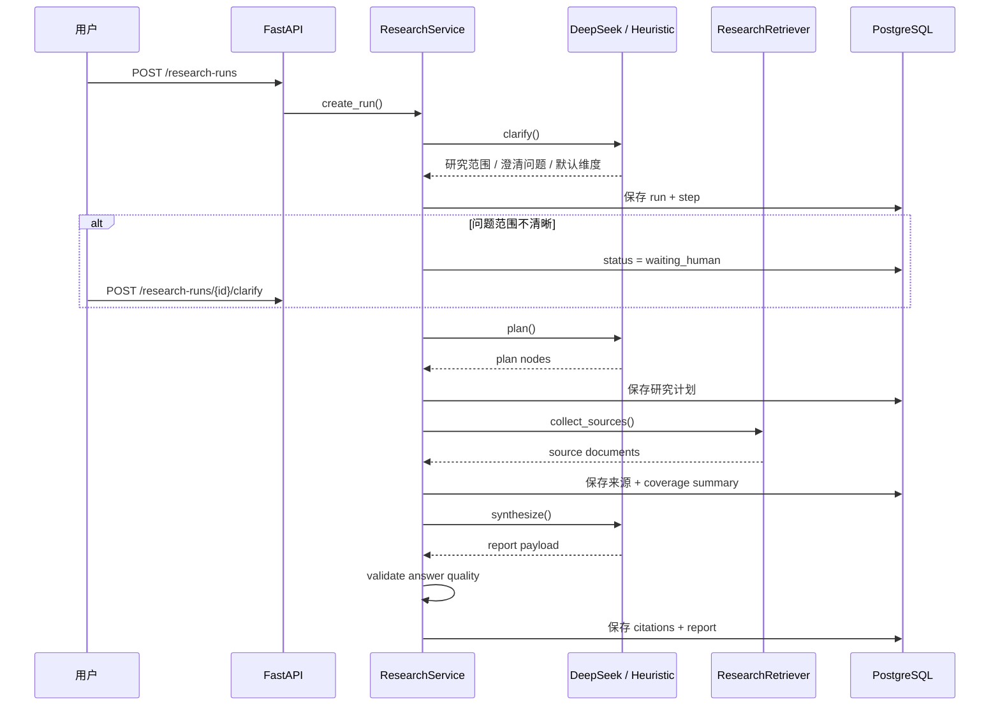

<div align="center">

# SignalDesk / 研策台

**面向 AI / Agent 技术选型场景的深度研究系统**

先找证据，再下结论。

[](https://github.com/riveeji/SignalDesk-deep-searching/stargazers)
[](https://github.com/riveeji/SignalDesk-deep-searching/network/members)
[](https://github.com/riveeji/SignalDesk-deep-searching/issues)
[](https://github.com/riveeji/SignalDesk-deep-searching/commits/main)

</div>

`SignalDesk` 不是聊天壳子，也不是简单的 RAG 页面。  
它把一次复杂研究任务拆成 `澄清 -> 规划 -> 检索 -> 综合 -> 校验` 的可回溯流程，最终输出带引用链、结论状态、证据覆盖与导出能力的结构化报告。

> 英文简介见 [README_EN.md](README_EN.md)

## 目录

- [它解决什么问题](#它解决什么问题)
- [为什么它更像高质量 AI 系统](#为什么它更像高质量-ai-系统)
- [界面与研究链路](#界面与研究链路)
- [核心能力](#核心能力)
- [真实运行结果](#真实运行结果)
- [技术架构](#技术架构)
- [项目结构](#项目结构)
- [快速开始](#快速开始)
- [配置说明](#配置说明)
- [适用场景](#适用场景)
- [路线图](#路线图)
- [常见问题](#常见问题)
- [贡献方式](#贡献方式)
- [相关文档](#相关文档)

## 它解决什么问题

很多“AI 研究产品”实际只做了两件事：

- 检索几条网页
- 让模型直接总结

这会带来三个常见问题：

- 问题范围没有收敛，结果容易答非所问
- 多候选比较时证据失衡，却仍然给强推荐
- 结果无法追溯，用户不知道结论到底基于什么来源

`SignalDesk` 的目标是把“技术选型研究”做成一个真正的系统流程，而不是一次性的模型回答。

## 为什么它更像高质量 AI 系统

- 不是单轮问答，而是完整的 `Deep Research Agent`
- 不是黑盒输出，而是保留 `Run / Step / Source / Citation / Report`
- 不是盲目自动化，而是支持人工澄清、来源排除和手动补源
- 不是只给答案，而是显式计算 `coverage / verdict / confidence`
- 不是 demo 页面，而是有持久化、导出、回放和重跑能力的研究系统

## 界面与研究链路

### 工作台结构


### 研究链路


## 核心能力

### 1. Agent 化研究流程

- `Clarifier`：在检索前先收敛问题范围
- `Planner`：把研究任务拆成可解释的计划节点
- `Retriever`：聚合多源证据并归一化
- `Synthesizer`：生成结构化报告、比较表、风险项和推荐结论
- `Answer Validator`：校验对题性、覆盖完整度和推荐置信度

### 2. 可插拔检索层

当前 provider：

- `GitHub`
- `Official Docs`
- `DuckDuckGo`
- `Crossref`
- `Semantic Scholar`（可选）
- `Google Programmable Search`（可选）
- `Google Scholar Manual`（仅手动导入）
- `CNKI Manual`（仅手动导入）

### 3. 证据建模与结果约束

系统显式计算：

- `coverage_summary`
- `verdict`
- `recommendation_confidence`
- `missing_evidence`
- `question_alignment_notes`

如果是多候选问题，但某个候选项缺少关键证据，系统会主动降级为 `insufficient_evidence`，而不是继续输出看起来完整但站不住的推荐结论。

### 4. Human-in-the-loop

用户可在 3 个关键点参与：

- 补充研究范围
- 排除低质量来源
- 手动导入外部证据

这让系统更接近真实研究工作流，而不是“模型自动跑完一切”的玩具 demo。

## 真实运行结果

以下数据来自当前服务里已经跑通的真实 run，而不是虚构 benchmark：

| 场景 | run id | 候选项 | 来源数 | 引用数 | 耗时 | 结果 |
| --- | --- | ---: | ---: | ---: | ---: | --- |
| Python Agent 底座选型：LangGraph vs PydanticAI vs Mastra | `research_22f8fcc3c7` | 3 | 15 | 35 | 164.5s | `grounded / high` |
| 单模型评估：DeepSeek 是否适合作为中文技术研究后端 | `research_6ce72c568b` | 1 | 3 | 7 | 133.2s | `grounded / medium` |
| 排除 Mastra 关键来源后的回归案例 | `research_0a1068cdbb` | 3 | 15 | 28 | 已验证 | `insufficient_evidence / low` |

第三个案例是这个项目最重要的证据之一：它证明系统会在证据失衡时主动降级，而不是继续输出“看起来很完整”的错误结论。

## 技术架构





## 项目结构

```text
.
├── backend
│   ├── app
│   │   ├── main.py
│   │   ├── research_service.py
│   │   ├── retrieval.py
│   │   ├── providers.py
│   │   ├── schemas.py
│   │   └── store.py
│   └── requirements.txt
├── frontend
│   ├── src/app
│   ├── src/components
│   └── src/lib
├── docs
│   ├── assets
│   ├── ARCHITECTURE.md
│   ├── CASE_STUDIES.md
│   ├── DEMO_SCRIPT.md
│   ├── INTERVIEW_PITCH.md
│   ├── PROVIDER_CONFIG.md
│   └── RESUME_NOTES.md
├── compose.yml
└── README.md
```

更详细的结构说明见 [docs/PROJECT_STRUCTURE.md](docs/PROJECT_STRUCTURE.md)。

## 快速开始

### 1. 安装后端依赖

```powershell
pip install -r backend\requirements.txt
```

### 2. 安装前端依赖

```powershell
cd frontend
npm install
cd ..
```

### 3. 启动 PostgreSQL

```powershell
docker compose -p deepresearch up -d postgres
```

### 4. 启动后端

```powershell
python -m uvicorn backend.app.main:app --host 127.0.0.1 --port 8000
```

### 5. 启动前端

```powershell
cd frontend
npm run dev
```

### 6. 打开页面

- 前端：`http://127.0.0.1:3000`
- 后端：`http://127.0.0.1:8000`
- PostgreSQL：`127.0.0.1:15432`

## 配置说明

### DeepSeek

```powershell
DEEP_RESEARCH_DEFAULT_PROVIDER=deepseek
DEEP_RESEARCH_DEEPSEEK_API_KEY=your_key
DEEP_RESEARCH_DEEPSEEK_BASE_URL=https://api.deepseek.com/v1
DEEP_RESEARCH_DEEPSEEK_MODEL=deepseek-chat
```

如果没有配置 API Key，系统会自动回退到 `heuristic`，保证整体流程仍然可演示。

### 搜索源

- 默认启用：`GitHub`、官方文档、`DuckDuckGo`、`Crossref`
- 可选启用：`Semantic Scholar`、`Google Programmable Search`
- 仅手动导入：`Google Scholar`、`CNKI`

更多说明见 [docs/PROVIDER_CONFIG.md](docs/PROVIDER_CONFIG.md)。

## 适用场景

- AI / Agent 框架选型
- 模型或推理后端适配性评估
- 开源项目对比研究
- 垂类技术调研和内部方案评审

## 路线图

近期规划见 [ROADMAP.md](ROADMAP.md)。

当前重点方向：

- 更细粒度的来源筛选与排序
- 更多学术搜索 provider
- 更强的报告可视化和导出能力
- 部署与演示体验完善

## 常见问题

常见问题见 [FAQ.md](FAQ.md)。

这里先回答两个最常见的：

- **它和普通 RAG 有什么区别？**  
  它不是“检索后总结”，而是有 `Clarifier / Planner / Validator` 的完整研究流程。

- **为什么要支持人工介入？**  
  因为真实研究任务里，范围澄清和来源取舍本来就不应该完全交给模型。

## 贡献方式

欢迎通过 issue 或 PR 参与改进。提交前建议先阅读：

- [CONTRIBUTING.md](CONTRIBUTING.md)
- [ROADMAP.md](ROADMAP.md)

适合优先贡献的方向：

- 检索源扩展
- 结果质量校验
- 前端报告体验
- 开发者文档和部署文档

## 相关文档

- 架构说明：[docs/ARCHITECTURE.md](docs/ARCHITECTURE.md)
- 项目结构：[docs/PROJECT_STRUCTURE.md](docs/PROJECT_STRUCTURE.md)
- 演示脚本：[docs/DEMO_SCRIPT.md](docs/DEMO_SCRIPT.md)
- 面试讲稿：[docs/INTERVIEW_PITCH.md](docs/INTERVIEW_PITCH.md)
- 案例与指标：[docs/CASE_STUDIES.md](docs/CASE_STUDIES.md)
- 简历写法：[docs/RESUME_NOTES.md](docs/RESUME_NOTES.md)
- 仓库 About 文案：[docs/GITHUB_ABOUT.md](docs/GITHUB_ABOUT.md)
- Provider 配置：[docs/PROVIDER_CONFIG.md](docs/PROVIDER_CONFIG.md)
