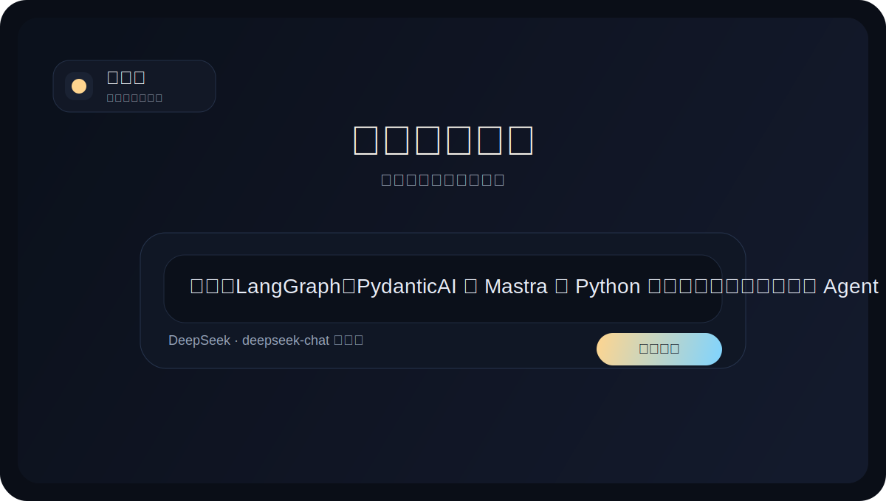
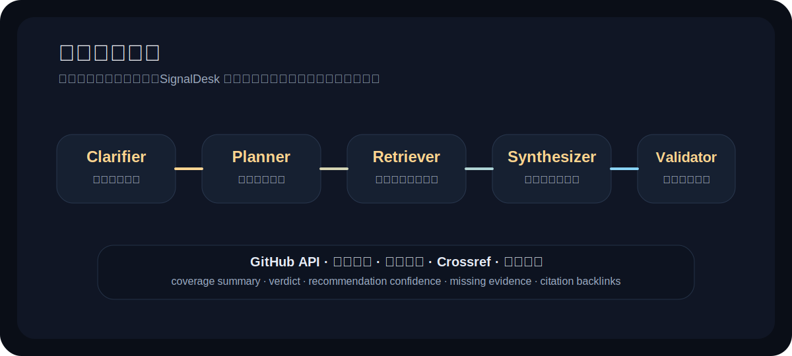
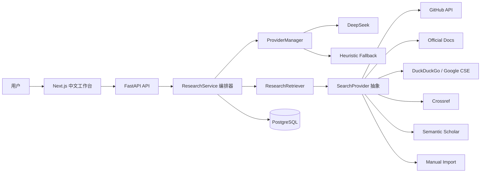
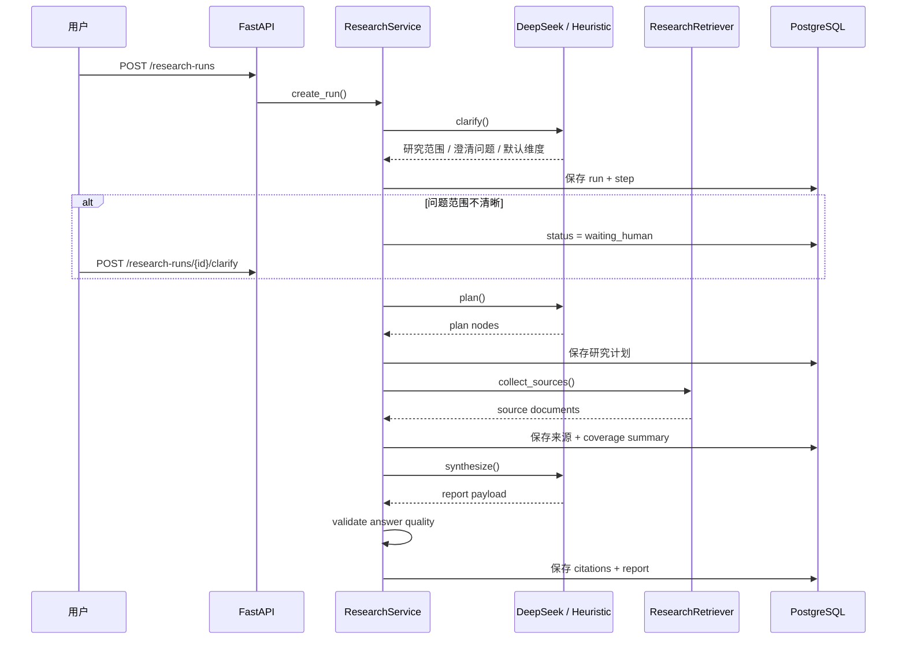

# SignalDesk / 研策台

`SignalDesk` 是一个面向 `AI / Agent` 技术选型场景的深度研究系统。

它不是聊天壳子，也不是简单的 RAG 页面，而是把一次复杂研究任务拆成 `澄清 -> 规划 -> 检索 -> 综合 -> 校验` 的可回溯流程，最后输出带引用链、结论状态和证据覆盖信息的结构化报告。

> 英文简介见 [README_EN.md](README_EN.md)

## 项目亮点

- 只保留一个搜索入口，直接输入复杂研究问题即可发起任务
- 支持 `Clarifier / Planner / Retriever / Synthesizer / Validator` 多阶段执行链
- 统一接入 `GitHub API`、官方文档、网页搜索、`Crossref` 与手动补源
- 用 `PostgreSQL` 持久化研究任务、来源池、步骤轨迹、引用链和最终报告
- 在证据不足时自动降级为 `insufficient_evidence`，避免高置信错误结论
- 支持人工补充范围、排除弱来源、手动导入来源、阶段级重跑和 `Markdown / PDF` 导出

## 适合放到简历里的价值

- 不是单轮问答，而是完整的 `Deep Research Agent`
- 不是只调模型接口，而是做了研究流程编排、证据建模和结果约束
- 不是黑盒输出，而是保留了来源、引用、步骤、覆盖矩阵和结论置信度
- 不是“一次性 demo”，而是有持久化、回放、重跑和导出能力的 AI 系统

## 界面示意

### 工作台结构



### 研究链路



## 系统架构



## 执行流程



## 核心能力

### 1. Agent 化研究流程

- `Clarifier`：先澄清问题，不让模糊问题直接进入检索阶段
- `Planner`：生成研究计划树，而不是盲目搜一圈
- `Retriever`：多源收集证据，并把来源统一归一化
- `Synthesizer`：输出结构化报告、比较表、推荐结论和风险项
- `Answer Validator`：检查覆盖情况、对题程度和推荐置信度

### 2. 可插拔检索层

当前 provider：

- `GitHub`
- `Official Docs`
- `DuckDuckGo`
- `Crossref`
- `Semantic Scholar`（可选）
- `Google Programmable Search`（可选）
- `Google Scholar Manual`（仅手动导入）
- `CNKI Manual`（仅手动导入）

### 3. 证据建模与结果约束

系统会显式计算：

- `coverage_summary`
- `verdict`
- `recommendation_confidence`
- `missing_evidence`
- `question_alignment_notes`

如果多候选问题中某个候选项证据覆盖不足，系统不会直接强推，而是自动降级为 `insufficient_evidence`。

### 4. 人机协作

用户可在 3 个节点介入：

- 补充研究范围
- 排除低质量来源
- 手动导入来源

这让系统更像真实研究产品，而不是“模型说了算”的一次性回答。

## 当前真实运行结果

以下数据来自当前服务中已经跑通的真实 run，而不是虚构 benchmark：

| 场景 | run id | 候选项 | 来源数 | 引用数 | 耗时 | 结果 |
| --- | --- | ---: | ---: | ---: | ---: | --- |
| Python Agent 底座选型：LangGraph vs PydanticAI vs Mastra | `research_22f8fcc3c7` | 3 | 15 | 35 | 164.5s | `grounded / high` |
| 单模型评估：DeepSeek 是否适合作为中文技术研究后端 | `research_6ce72c568b` | 1 | 3 | 7 | 133.2s | `grounded / medium` |
| 排除 Mastra 关键来源后的回归案例 | `research_0a1068cdbb` | 3 | 15 | 28 | 已验证 | `insufficient_evidence / low` |

第三个案例是这个项目最关键的证据之一：它证明系统会在证据失衡时主动降级，而不是继续输出看起来完整但站不住的结论。

## 技术栈

- 前端：`Next.js`、`TypeScript`、`Tailwind CSS`
- 后端：`FastAPI`
- 数据库：`PostgreSQL`
- 模型：`DeepSeek`
- 检索：`GitHub API`、官方文档抓取、网页搜索、`Crossref`、手动导入

## 核心对象

- `ResearchRun`
- `ResearchPlanNode`
- `SourceDocument`
- `RunStep`
- `Citation`
- `FinalReport`

## 关键接口

- `POST /research-runs`
- `GET /research-runs`
- `GET /research-runs/{id}`
- `GET /research-runs/{id}/steps`
- `GET /research-runs/{id}/sources`
- `POST /research-runs/{id}/sources/import`
- `POST /research-runs/{id}/sources/{source_id}`
- `GET /research-runs/{id}/report`
- `GET /research-runs/{id}/report/markdown`
- `GET /research-runs/{id}/report/pdf`
- `POST /research-runs/{id}/clarify`
- `POST /research-runs/{id}/retry-step`

## 快速开始

### 1. 安装后端依赖

```powershell
pip install -r backend\requirements.txt
```

### 2. 安装前端依赖

```powershell
cd frontend
npm install
cd ..
```

### 3. 启动 PostgreSQL

```powershell
docker compose -p deepresearch up -d postgres
```

### 4. 启动后端

```powershell
python -m uvicorn backend.app.main:app --host 127.0.0.1 --port 8000
```

### 5. 启动前端

```powershell
cd frontend
npm run dev
```

## 本地地址

- 前端：`http://127.0.0.1:3000`
- 后端：`http://127.0.0.1:8000`
- 数据库：`127.0.0.1:15432`

## DeepSeek 配置

详见 [docs/PROVIDER_CONFIG.md](docs/PROVIDER_CONFIG.md)。

```powershell
DEEP_RESEARCH_DEFAULT_PROVIDER=deepseek
DEEP_RESEARCH_DEEPSEEK_API_KEY=your_key
DEEP_RESEARCH_DEEPSEEK_BASE_URL=https://api.deepseek.com/v1
DEEP_RESEARCH_DEEPSEEK_MODEL=deepseek-chat
```

如果没有配置 API Key，系统会回退到 `heuristic`，保证整体流程仍然可演示。

## 相关文档

- 架构说明：[docs/ARCHITECTURE.md](docs/ARCHITECTURE.md)
- 演示脚本：[docs/DEMO_SCRIPT.md](docs/DEMO_SCRIPT.md)
- 面试讲稿：[docs/INTERVIEW_PITCH.md](docs/INTERVIEW_PITCH.md)
- 案例与指标：[docs/CASE_STUDIES.md](docs/CASE_STUDIES.md)
- 简历写法：[docs/RESUME_NOTES.md](docs/RESUME_NOTES.md)
- Provider 配置：[docs/PROVIDER_CONFIG.md](docs/PROVIDER_CONFIG.md)
