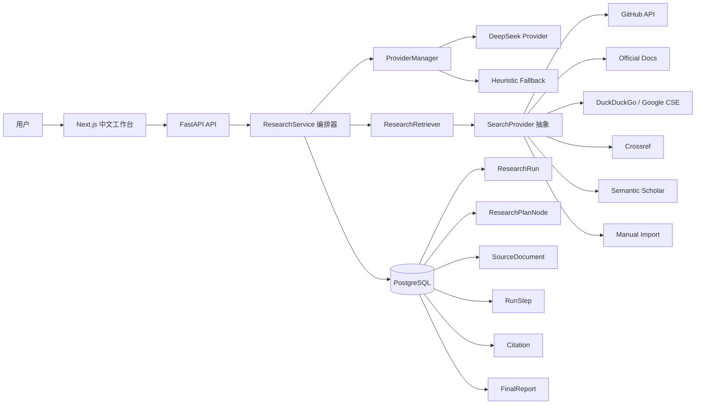
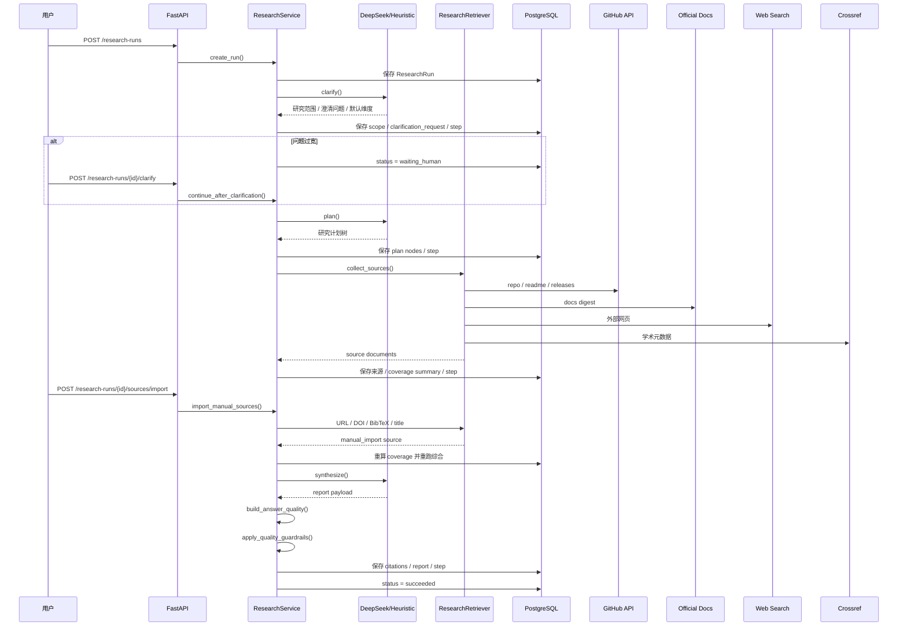

# 架构说明

## 系统定位

这个项目不是聊天机器人，而是一个面向 `AI / Agent 技术选型` 的深度研究系统。  
目标是把一次复杂研究任务拆成可解释、可暂停、可重跑、可导出的流程。

核心阶段：

- `Clarifier`
- `Planner`
- `Retriever`
- `Synthesizer`
- `Answer Validator`

## 整体架构

## 执行链

## 为什么这个架构值钱

- 它有完整的 `agent loop`，不是单次调用 LLM。
- 它把“研究质量”显式建模成 `coverage summary + answer quality`。
- 它允许人类在关键点介入，而不是假装全自动。
- 它支持多源检索、学术补源、阶段级重跑和导出产物。

## 核心对象

- `ResearchRun`
  一次研究任务，记录状态、范围、计数和当前摘要。
- `ResearchPlanNode`
  研究计划树节点，用来解释为什么去搜这些内容。
- `SourceDocument`
  来源归一化对象，统一承接 GitHub、文档、网页、学术、手动导入。
- `RunStep`
  每个阶段的轨迹记录，保存输入、输出和状态。
- `Citation`
  报告段落到来源证据的回链。
- `FinalReport`
  最终结构化报告，包含 `verdict / confidence / missing_evidence / alignment notes`。

## 当前最关键的设计点

### 1. SearchProvider 抽象

检索层已经从硬编码源切成可插拔 provider，当前内置：

- `GitHub`
- `Official Docs`
- `DuckDuckGo`
- `Crossref`
- `Semantic Scholar`
- `Google Programmable Search`
- `Google Scholar Manual`
- `CNKI Manual`

其中后两者只支持手动导入，不做自动抓取。

### 2. Answer Validator

综合阶段不会直接相信模型输出，而是额外检查：

- 是否真的围绕原问题回答
- 每个候选项是否都有最低覆盖
- 是否存在单候选证据主导多候选结论
- 比较维度是否被实际支撑

如果不满足，就降级成：

- `verdict = insufficient_evidence`
- `recommendation_confidence = low`

### 3. Human-in-the-loop

保留三类人工参与点：

- 范围澄清
- 排除弱来源
- 手动导入来源

这让项目更像真实研究产品，而不是“模型说了算”。
